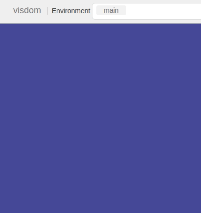

Some graph makers for reports, updated as needed.

Fed up with directly using matplotlib again and again from scratch, this is my online repo so I don't have to worry about deleting re-usable code.

**Dependencies**

* seaborn

* pandas

* numpy

* matplotlib

* Visdom ( only for plotting on Visdom )

1) barPlot

<p float="center">
  
</p>

Plots a single bar plot using seaborn. 
```python
barPlot( y, x_label, y_label, x=None, title=None, font=1, ylim=0, extreme=0)
```
```bash

y -> data itself

x_label -> x axis decription

y_label -> y axis decription

x -> OPTIONAL x co-ordinates of data, if none then assigned numbers 0, 1, ... (# element y) - 1

title -> OPTIONAL graph title

font -> OPTIONAL font size

ylim -> limit of the y axis. By default adjusted by data

extreme -> if there are lots of data points directly use matplotlib
```
2) multiBarPlot

<p float="center">
  
</p>

Bar plots with multiple bars
```python
multiBarPlot(y, z, x_label, y_label, legName, x=None, title=None, font=1, ylim=0, order=None)
```
```bash

y -> data itself

z -> list indicating the bar number of each data point in y 

x_label -> x axis decription

y_label -> y axis decription

legName -> legend title   

x -> OPTIONAL x co-ordinates of data, if none then assigned numbers 0, 1, ... (# element y) - 1

title -> OPTIONAL graph title

font -> OPTIONAL font size

ylim -> limit of the y axis. By default adjusted by data

extreme -> if there are lots of data points directly use matplotlib

order -> the order in which bars are present, needed only if x is used
```

3) linePlot

<p float="center">
  
</p>

```python
linePlot(y, x_label, y_label, x=None, z=None, z_label=None, title=None, font=1)
```

```bash
y -> data itself

x_label -> x axis decription

y_label -> y axis decription

x -> OPTIONAL x co-ordinates of data, if none then assigned numbers 0, 1, ... (# element y) - 1

title -> OPTIONAL graph title

font -> OPTIONAL font size

z -> OPTIONAL list indicating the bar number of each data point in y 

z_label -> z label name
```

4) Interactive plotting with Visdom.



See file for explanation. Demo can be run with 

```bash
python -m visdom.server # navigate to http://localhost:8097/ in a web browser
python vizPlot.py
```

